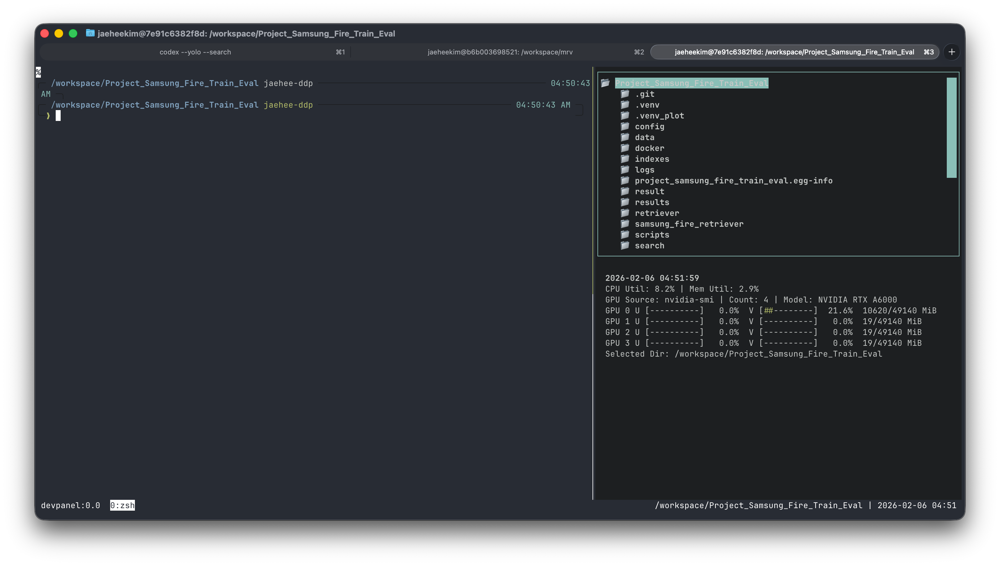

# term-workspace

`tmux` workspace launcher with:
- right-side clickable directory tree
- right-side GPU/VRAM/CPU monitor
- multi-GPU utilization + VRAM color bars
- clipboard-friendly `tmux` interaction defaults

## Requirements

- `tmux` (3.2+ recommended)
- Python 3.9+
- `nvidia-smi` (optional, for NVIDIA GPU metrics)

## Install

### Option 1: pipx (recommended)

```bash
pipx install git+https://github.com/KimJaehee0725/term-workspace.git
```

### Option 2: pip user install

```bash
python3 -m pip install --user git+https://github.com/KimJaehee0725/term-workspace.git
```

### Option 3: from release wheel

```bash
python3 -m pip install --user https://github.com/KimJaehee0725/term-workspace/releases/download/v0.2.1/term_workspace-0.2.1-py3-none-any.whl
```

## Screenshot



## Run

```bash
term-workspace
```

Common options:

```bash
term-workspace --session devpanel --root ~/project --panel-width-percent 45
term-workspace --no-attach
```

## Interaction

- click directory in right tree: left pane runs `cd` to that directory
- click supported files in right tree: open in left pane editor (`$VISUAL`/`$EDITOR`, fallback `nvim`/`vim`/`nano`/`vi`/`less`)
  - supported: `.py`, `.pyi`, `.sh`, `.bash`, `.zsh`, `.json`, `.jsonl`, `.yaml`, `.yml`, `.toml`, `.ini`, `.cfg`, `.conf`, `.txt`, `.md`
- drag center border: resize left/right pane width
- pane drag selection is disabled to avoid accidental cross-pane drag overlap

Clipboard behavior:

- system clipboard copy in copy-mode:
  - `prefix` + `[` to enter copy-mode
  - select text, then `Enter` or `y` to copy to system clipboard
- system clipboard paste:
  - `prefix` + `v`

On macOS, if your terminal supports native `Cmd+C/Cmd+V`, those can still be used for normal terminal selection/paste.

## Linux notes

- Wayland: install `wl-copy` and `wl-paste` for clipboard integration
- X11: install `xclip` or `xsel`

## macOS notes

- Uses `pbcopy` / `pbpaste` for clipboard integration
- Apple GPU utilization is often unavailable without privileged tools; VRAM may still show

## Release

This repo includes GitHub Actions workflow at `.github/workflows/release.yml`.

Release flow:

1. Update version in `pyproject.toml` and `src/term_workspace/__init__.py`
2. Commit and push
3. Create and push tag (example `v0.2.1`)
4. Workflow builds `wheel` / `sdist` and attaches them to GitHub Release
